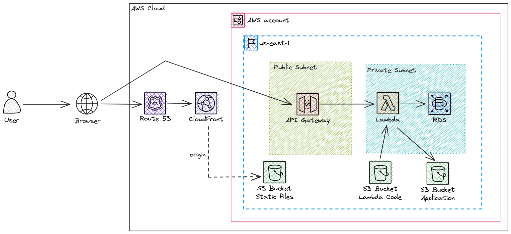

# Serverless Architecture




The goal of this project is to create a serverless architecture in AWS, deploying a static website through CloudFront (using S3 as origin), an API in a Lambda, and a database using RDS.


**Networking Layer (VPC)**  
Isolated Environment: A custom VPC with dedicated CIDR blocks and full DNS support.

High Availability: Subnets are strategically distributed across three Availability Zones (AZs).

Network Segregation: Features both Public Subnets for ingress traffic and Private Subnets for secure backend and database hosting.

Traffic Control: Dedicated Security Groups manage strict communication rules between the Lambda function and the RDS instance.

**Frontend Layer (Global Content Delivery)**  
S3 Static Hosting: A private S3 bucket stores the web assets (e.g., index.html).

Edge Distribution: AWS CloudFront serves as the global CDN to provide low-latency access.

Origin Security: Utilizes Origin Access Control (OAC) to ensure that the S3 bucket is only accessible via CloudFront.

Custom Domain & SSL: The project uses Route 53 to manage application traffic and identity through the following registries:

| Record | Final Destination | User Experience (URL) |
| :--- | :--- | :--- |
| **Validation** | Internal (ACM) | None (Technical use for SSL/TLS) |
| **Admin** | CloudFront | `admin.yourdomain.com.br` |
| **Root** | CloudFront | `yourdomain.com.br` |
| **WWW** | CloudFront | `www.yourdomain.com.br` |
| **API** | API Gateway | `api.yourdomain.com.br` |

Also uses Certificate Manager (ACM) for automated SSL/TLS certificates.


**Backend & Database Layer (Serverless API)**  
Serverless Logic: An AWS Lambda function running Node.js handles application logic and database interactions.
The AWS Lambda function serves as the core intelligence of the application, acting as a secure bridge between the public internet and the private data layer.

Secure Database Proxy: Since the RDS instance is hosted in a Private Subnet without a public IP, the Lambda function (residing within the VPC) acts as the only authorized gateway to interact with the database.
Automated Access Logging: It automatically intercepts incoming requests from API Gateway, extracting metadata such as IP addresses, request paths, and User-Agents, and persists them into the MySQL database.

Database Connection: The Lambda function is VPC-connected to communicate securely with the RDS instance in private subnets.

REST Interface: AWS API Gateway exposes the Lambda function through a custom subdomain (api.domain.com.br).

Managed SQL: An Amazon RDS MySQL instance provides a robust, auto-scaling relational database with automated minor version upgrades.

Infrastructure Components
Terraform State: Configured for remote state management via S3 to enable collaboration and safety.

IAM Security: Implements least-privilege execution roles for the Lambda function, granting access only to necessary S3 and RDS resources.

Environment Configuration: Key database credentials and hostnames are passed to the backend via secure Lambda environment variables.

Domain: A registered domain managed through AWS Route 53.

## How to run this project

### Pre-requisites
Some configurations and resources are expected to be set before you run this project.

1) Configure Route53

### Create Hosted Zone

```powershell
$timestamp = Get-Date -Format "yyyyMMddHHmmss"

aws route53 create-hosted-zone --name "domain.com.br" --caller-reference $timestamp

```
When you run this command, the terminal will display a JSON. Look for the `NameServers` section. You will need these 4 addresses to configure with your domain registrar:

1.  `ns-xxxx.awsdns-xx.com.`
2.  `ns-xxxx.awsdns-xx.org.`
3.  `ns-xxxx.awsdns-xx.co.uk.`
4.  `ns-xxxx.awsdns-xx.net.`


2) Create a S3 bucket to store the Terraform state file
Manually create an S3 bucket, we will use this bucket to store the state file of the Terraform.

### Running the project

1) Set the Terraform backend
Go to the `versions.tf` file and change the backend configuration to point to the S3 Bucket that you created manually to store the terraform state.

2) Create your `terraform.tfvars` file
You can read the `README_TERRAFORM.md` file to check all the variables accepted by the code.

A possible example of the variables file:
```ini
## COMMON
aws_region = "us-east-1"
domain_name = "domain.com"

## FRONTEND
frontend_bucket_name = "static-frontend-flat"
frontend_subdomain = "admin"

## BACKEND
backend_subdomain = "api"
backend_s3_bucket_name = "lambdas-code-flat"
backend_s3_bucket_name_application = "api-bucket-flat"

backend_lambda_name = "api"
backend_lambda_s3_object = "lambda_function.zip"
backend_lambda_memory_in_MB = 512
backend_api_gateway_name = "api-gateway"

## DATABASE
database_identifier = "api-database"
database_requested_storage_in_GiB = 20
database_max_storage_in_GiB = 30
database_name = "app"
database_engine_version = "8.0"
database_password = "12341234"
database_instance_class = "db.t4g.micro"
backend_lambda_environments_variables = {
    USER = "root",
    PASSWORD = "12341234",
    BATABASE = "app"
    LOGGER_LEVEL = "DEBUG"
}
```

3) Create the infrastructure using Terraform
```powershell
terraform init
terraform apply -var-file="terraform.tfvars"
```

## Project Endpoints  

Main Frontend: https://domain.com.br  
Backend API: https://api.domain.com.br

## Useful Commands
Use these commands to package your code and deploy it directly to AWS:

## Package the code to apply (Ensure you are in the code directory in terminal)
```powershell
Compress-Archive -Path "index.js", "node_modules", "package.json" -DestinationPath "lambda_function.zip" -Force
```
## Update the Lambda function code (or just run terraform apply again)
```powershell
aws lambda update-function-code --function-name api --zip-file fileb://lambda_function.zip
```

## Monitoring
Monitor your application's behavior and health in real-time:
```powershell
# Stream live CloudWatch logs from the API
aws logs tail "/aws/lambda/api" --follow --region us-east-1
```

## Verify API headers and connectivity
```powershell
curl -vI https://api.domain.com.br/
```
## Database Testing

Create the database before acessing the domain:

```powershell
./scripts/create-table.ps1
```

To query the logs stored in your RDS instance through the Lambda bridge:
```powershell
./scripts/test-select.ps1
```

## References
https://github.com/felipelaptrin/serverless-infra